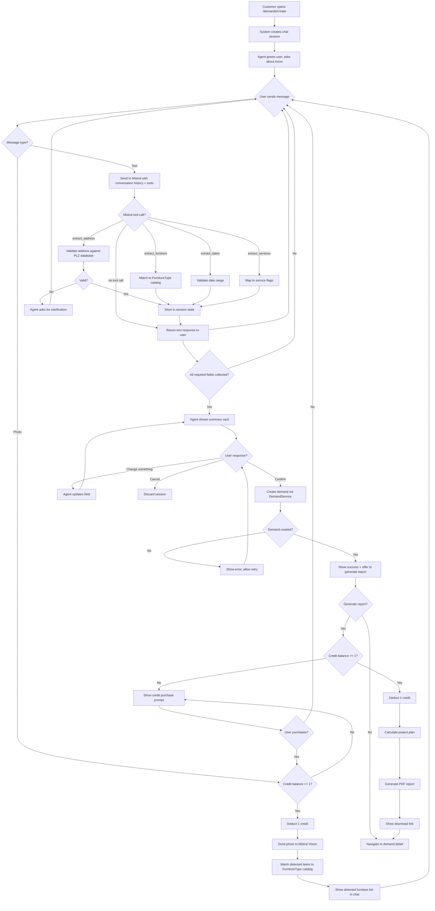
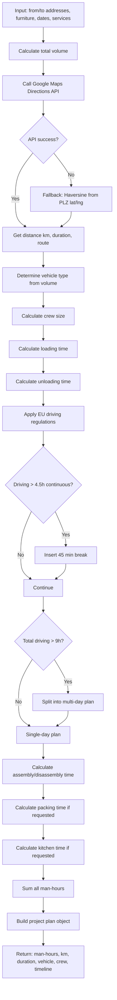
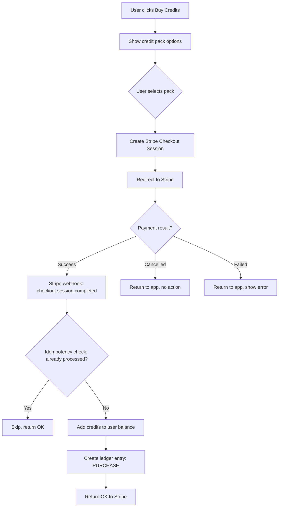
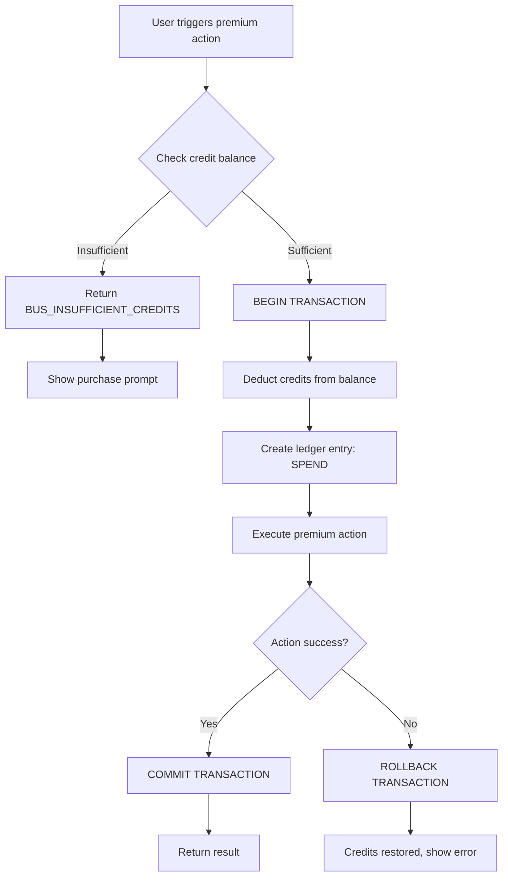
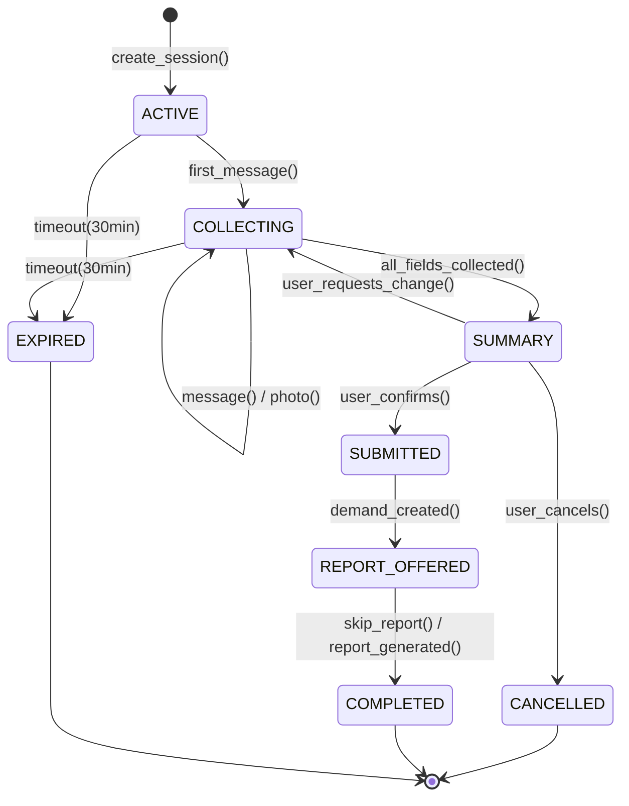

# Business Logic: AI Moving Assistant

**Version:** 1.0.0
**Input:** USER_STORIES.md, SRS.md, DATA_CLASSIFICATION.md

---

## 1. Process Flows

### 1.1 Agent Chat Session (US-AGENT-01, US-AGENT-02, US-AGENT-03)



### 1.2 Project Plan Calculation (US-CALC-01 to US-CALC-05)



### 1.3 Credit Purchase (US-CREDIT-01)



### 1.4 Credit Spend (US-CREDIT-02)



---

## 2. State Machines

### 2.1 Chat Session State



| From | To | Trigger | Guard | Side Effect | Rule |
|------|----|---------|-------|-------------|------|
| ACTIVE | COLLECTING | first_message() | Session exists | Store message | BR-AGT-001 |
| COLLECTING | SUMMARY | all_fields_collected() | All required fields present | Generate summary | BR-AGT-002 |
| SUMMARY | SUBMITTED | user_confirms() | Summary approved | Call DemandService.create() | BR-AGT-003 |
| SUMMARY | COLLECTING | user_requests_change() | None | Update field, regenerate summary | BR-AGT-004 |
| COLLECTING | EXPIRED | timeout(30min) | No message for 30 min | Cleanup session from Redis | BR-AGT-005 |
| REPORT_OFFERED | COMPLETED | report_generated() | Credit deducted | Generate PDF, store | BR-AGT-006 |

### 2.2 Credit Ledger (append-only, no state transitions)

Entry types: `PURCHASE`, `SPEND`, `REFUND`, `ADJUSTMENT`

---

## 3. Decision Matrices

### 3.1 Vehicle Selection (BR-CALC-003)

| Total Volume (m³) | Vehicle Type | Max Load | Requires License |
|-------------------|-------------|----------|-----------------|
| 0 — 12 | Transporter (Sprinter) | 12 m³ | B (car) |
| 13 — 25 | LKW 3.5t | 25 m³ | B (car) |
| 26 — 45 | LKW 7.5t | 45 m³ | C1 (truck) |
| 46 — 65 | LKW 12t | 65 m³ | C (truck) |
| > 65 | Multiple vehicles | Split load | Mixed |

### 3.2 Crew Size Calculation (BR-CALC-002)

| Volume (m³) | Base Crew | No Elevator + Floor > 2 (from) | No Elevator + Floor > 2 (to) | Final Crew |
|-------------|-----------|-------------------------------|------------------------------|------------|
| 0 — 20 | 2 | +1 | +1 | 2-4 |
| 21 — 40 | 3 | +1 | +1 | 3-5 |
| 41 — 65 | 4 | +1 | +1 | 4-6 |
| > 65 | 5 | +1 | +1 | 5-7 |
| Any | Min 2 | — | — | Max 8 |

### 3.3 EU Driving Regulation (BR-CALC-004)

| Continuous Driving | Action | Rule Reference |
|-------------------|--------|----------------|
| ≤ 4.5 hours | Continue | EC 561/2006 Art. 7 |
| > 4.5 hours | Mandatory 45 min break | EC 561/2006 Art. 7 |
| Daily total ≤ 9 hours | Normal day | EC 561/2006 Art. 6(1) |
| Daily total 9 — 10 hours | Allowed max 2x/week | EC 561/2006 Art. 6(1) |
| Daily total > 10 hours | NOT ALLOWED — split to next day | EC 561/2006 Art. 6(1) |
| Weekly total > 56 hours | NOT ALLOWED | EC 561/2006 Art. 6(2) |

### 3.4 Credit Pack Pricing (BR-CRD-001)

| Pack | Credits | Price (EUR) | Per Credit | Discount |
|------|---------|-------------|------------|----------|
| Starter | 5 | 5.00 | 1.00 | 0% |
| Standard | 20 | 15.00 | 0.75 | 25% |
| Pro | 50 | 30.00 | 0.60 | 40% |

### 3.5 Credit Cost Per Action (BR-CRD-002)

| Action | Credit Cost | Refundable | Rule |
|--------|------------|------------|------|
| Demand creation | 0 (Free) | N/A | BR-CRD-002a |
| Moving plan report | 1 | No (consumed) | BR-CRD-002b |
| Photo analysis (up to 10 photos) | 1 | No (consumed) | BR-CRD-002c |

### 3.6 Mistral Tool Selection (BR-AGT-007)

| Collected So Far | Missing Fields | Agent Strategy |
|-----------------|----------------|----------------|
| Nothing | All | Ask about move (from/to) |
| Addresses | Estate, furniture, dates | Ask about apartment type |
| Addresses + estate | Furniture, dates | Ask about furniture OR suggest photo |
| Addresses + estate + furniture | Dates, services | Ask about preferred dates |
| All required | None | Show summary |

---

## 4. Business Rules Catalog

### BR-AGT-001: Session Creation
**User Story:** US-AGENT-01
**Module:** Agent

**Rule:** A new chat session is created when customer navigates to demand creation page.
- Session stored in Redis with 30-minute TTL (refreshed on each message)
- Session contains: userId, conversationHistory[], extractedData{}, state
- Max 1 active session per user (previous session discarded)

### BR-AGT-002: Required Fields Check
**User Story:** US-AGENT-01
**Module:** Agent

**Rule:** Demand can only be submitted when ALL required fields are collected.

| Field | Required | Source |
|-------|----------|--------|
| from.address (street, houseNumber, postCode, placeName) | Yes | Chat extraction |
| to.address (street, houseNumber, postCode, placeName) | Yes | Chat extraction |
| from.estate.estateTypeId | Yes | Chat extraction |
| from.estate.totalSquareMeters | Yes | Chat extraction |
| from.estate.numberOfRooms | Yes | Chat extraction |
| from.estate.parts[].furnitureItems[] | Yes (min 1 item) | Chat or photo |
| preferredDateStart | Yes | Chat extraction |
| preferredDateEnd | Yes | Chat extraction |
| numberOfPeople | No (default: 2) | Chat extraction |
| serviceType | No (default: PRIVATE_MOVE) | Chat extraction |
| transportType | No (default: LOCAL, auto-detect from distance) | Calculated |

### BR-AGT-003: Transport Type Auto-Detection
**User Story:** US-AGENT-01
**Module:** Agent

| Distance (km) | Transport Type |
|---------------|---------------|
| 0 — 50 | LOCAL |
| 51 — 500 | LONG_DISTANCE |
| > 500 | INTERNATIONAL (if different country) or LONG_DISTANCE |

### BR-AGT-008: Photo Analysis Matching
**User Story:** US-AGENT-02
**Module:** Agent

**Rule:** Mistral Vision returns furniture descriptions. System matches to FurnitureType catalog.

| Match Confidence | Action |
|-----------------|--------|
| > 80% | Auto-add to list |
| 50-80% | Add with "?" flag, ask user to confirm |
| < 50% | Show as suggestion, user must manually confirm |
| No match | Show detected text, ask user to select from catalog |

### BR-CALC-001: Volume Calculation
**User Story:** US-CALC-05
**Module:** Calculator

**Rule:** Reuse existing VolumeCalculatorService. Total volume = Σ(furnitureType.volume × quantity)

### BR-CALC-002: Crew Size Formula
**User Story:** US-CALC-02
**Module:** Calculator

```
baseCrew = ceil(totalVolume / 20) + 1
if from.elevator == NONE && from.floor > 2: baseCrew += 1
if to.elevator == NONE && to.floor > 2: baseCrew += 1
crew = clamp(baseCrew, 2, 8)
```

### BR-CALC-003: Vehicle Selection
**User Story:** US-CALC-03
**Module:** Calculator

See Decision Matrix 3.1. If totalVolume > 65 m³:
```
vehicleCount = ceil(totalVolume / 65)
vehicleType = LKW 12t
```

### BR-CALC-004: EU Driving Regulation
**User Story:** US-CALC-04
**Module:** Calculator

See Decision Matrix 3.3. Timeline generation:
```
segments = []
remainingDrive = totalDrivingHours
dailyDrive = 0

while remainingDrive > 0:
  segment = min(4.5, remainingDrive)
  segments.add(DRIVE segment hours)
  remainingDrive -= segment
  dailyDrive += segment

  if remainingDrive > 0 AND dailyDrive < 9:
    segments.add(BREAK 45 min)
  elif dailyDrive >= 9:
    segments.add(OVERNIGHT REST)
    dailyDrive = 0
```

### BR-CALC-005: Man-Hour Breakdown
**User Story:** US-CALC-05
**Module:** Calculator

```
loadingHours = (totalVolume × 12 min/m³) / crew / 60
unloadingHours = (totalVolume × 10 min/m³) / crew / 60
assemblyHours = Σ(assemblable items × assemblyCost / 60) (from FurnitureType)
disassemblyHours = Σ(assemblable items × disassembleCost / 60) (from FurnitureType)
packingHours = if packingService: totalVolume × 8 min/m³ / crew / 60
kitchenHours = if kitchenMontage: 4 hours (flat)
drivingHours = routeDuration (from Google Maps)

totalManHours = (loadingHours + unloadingHours + assemblyHours + disassemblyHours + packingHours + kitchenHours) × crew + drivingHours × numberOfDrivers
```

### BR-CRD-001: Credit Pack Purchase
**User Story:** US-CREDIT-01
**Module:** Credit

**Rule:** Credits added ONLY after confirmed Stripe webhook (not after redirect).
- Idempotency: Stripe checkout session ID used as idempotency key
- Double-purchase prevention: Check if session ID already processed

### BR-CRD-002: Credit Deduction
**User Story:** US-CREDIT-02
**Module:** Credit

**Rule:** Atomic operation — check + deduct in single transaction.
- If balance < cost: return BUS_INSUFFICIENT_CREDITS
- Credits NEVER go negative
- Ledger entry created in same transaction

### BR-CRD-003: Credit Non-Refundability
**User Story:** US-CREDIT-01
**Module:** Credit

**Rule:** Spent credits are non-refundable. Unused credits are non-refundable but remain in account indefinitely (no expiry).

---

## 5. Business Exception Codes

| Code | Module | Description | HTTP | User Action |
|------|--------|-------------|------|-------------|
| BUS_INSUFFICIENT_CREDITS | Credit | Not enough credits for action | 402 | Purchase credits |
| BUS_SESSION_EXPIRED | Agent | Chat session timed out (30 min) | 410 | Start new session |
| BUS_SESSION_NOT_FOUND | Agent | Invalid session ID | 404 | Start new session |
| BUS_PHOTO_TOO_LARGE | Agent | Photo exceeds 10 MB | 413 | Resize and retry |
| BUS_PHOTO_INVALID_TYPE | Agent | Not JPEG/PNG/WebP | 415 | Use supported format |
| BUS_PHOTO_UNRECOGNIZABLE | Agent | Cannot detect furniture | 422 | Take better photo |
| BUS_ADDRESS_NOT_FOUND | Agent | Cannot parse/validate address | 422 | Provide more details |
| BUS_FIELDS_INCOMPLETE | Agent | Required fields missing at submit | 422 | Continue conversation |
| BUS_DUPLICATE_SESSION | Agent | User already has active session | 409 | Resume or discard |
| BUS_PAYMENT_FAILED | Credit | Stripe payment failed | 402 | Retry payment |
| BUS_WEBHOOK_DUPLICATE | Credit | Webhook already processed | 200 | None (idempotent) |
| BUS_ROUTE_UNAVAILABLE | Calc | Cannot calculate route | 503 | Retry or use fallback |
| BUS_REPORT_GENERATION_FAILED | Calc | PDF generation failed | 500 | Retry |

---

## 6. Data Validation Rules

### 6.1 Photo Upload
| Field | Rule | Error |
|-------|------|-------|
| file size | ≤ 10 MB | BUS_PHOTO_TOO_LARGE |
| file type | JPEG, PNG, WebP | BUS_PHOTO_INVALID_TYPE |
| count per batch | 1-10 | VAL_INVALID_RANGE |
| dimensions | min 200×200 px | VAL_PHOTO_TOO_SMALL |

### 6.2 Chat Message
| Field | Rule | Error |
|-------|------|-------|
| text length | 1 — 2000 chars | VAL_INVALID_LENGTH |
| rate limit | max 20 messages/minute | VAL_RATE_LIMITED |

### 6.3 Credit Purchase
| Field | Rule | Error |
|-------|------|-------|
| packId | Must be valid pack (starter/standard/pro) | VAL_INVALID_PACK |
| currency | EUR only | VAL_INVALID_CURRENCY |

---

## 7. External Integrations

### 7.1 Mistral AI API

**Type:** REST API | **Direction:** Outbound

| Field | Value |
|-------|-------|
| Endpoint | `https://api.mistral.ai/v1/chat/completions` |
| Vision endpoint | Same, with image content blocks |
| Protocol | HTTPS |
| Auth | Bearer token (API key) |
| Rate limit | 50 req/min (adjustable) |
| Timeout | 30 seconds |
| Fallback | Return "I couldn't process that, could you rephrase?" |

**Error Handling:**
| Error | Action | Business Exception |
|-------|--------|-------------------|
| 429 Rate Limited | Retry with exponential backoff (max 3) | None (transparent) |
| 500/503 | Retry once, then fail gracefully | BUS_AI_UNAVAILABLE |
| Timeout | Retry once with shorter prompt | BUS_AI_TIMEOUT |
| Invalid response | Log, ask user to rephrase | None |

### 7.2 Google Maps Directions API

**Type:** REST API | **Direction:** Outbound

| Field | Value |
|-------|-------|
| Endpoint | `https://maps.googleapis.com/maps/api/directions/json` |
| Protocol | HTTPS |
| Auth | API key (query param) |
| Rate limit | 100 req/min |
| Timeout | 10 seconds |
| Fallback | Haversine distance from PLZ lat/lng table (8305 entries) |

**Error Handling:**
| Error | Action | Business Exception |
|-------|--------|-------------------|
| ZERO_RESULTS | Use Haversine fallback | None (transparent) |
| OVER_QUERY_LIMIT | Queue and retry | None (transparent) |
| REQUEST_DENIED | Log alert, use fallback | BUS_ROUTE_UNAVAILABLE |
| Timeout | Use fallback | None (transparent) |

### 7.3 Stripe API

**Type:** REST API + Webhooks | **Direction:** Bidirectional

| Field | Value |
|-------|-------|
| Checkout endpoint | Stripe SDK (server-side) |
| Webhook endpoint | POST /api/v1/payments/webhook |
| Protocol | HTTPS |
| Auth | Secret key (server), webhook signing secret |
| Timeout | 30 seconds |
| Idempotency | Stripe checkout session ID |

**Webhook Events:**
| Event | Action |
|-------|--------|
| `checkout.session.completed` | Add credits, create ledger entry |
| `checkout.session.expired` | Log, no action |
| `charge.refunded` | Add credits back (REFUND ledger entry) |

**Error Handling:**
| Error | Action | Business Exception |
|-------|--------|-------------------|
| Webhook signature invalid | Reject (403) | None (security) |
| Duplicate webhook | Return 200 (idempotent) | BUS_WEBHOOK_DUPLICATE |
| Stripe API down | Show error, retry later | BUS_PAYMENT_FAILED |

---

## 8. Audit Events

| Event | Data Logged | Retention |
|-------|------------|-----------|
| CHAT_SESSION_CREATED | userId, sessionId | 30 days |
| CHAT_SESSION_COMPLETED | userId, sessionId, demandId | 30 days |
| PHOTO_ANALYZED | userId, photoCount, itemsDetected | 30 days |
| CREDIT_PURCHASED | userId, packId, amount, stripeSessionId | 7 years |
| CREDIT_SPENT | userId, action, amount, balanceAfter | 7 years |
| CREDIT_REFUNDED | userId, reason, amount, balanceAfter | 7 years |
| REPORT_GENERATED | userId, demandId, reportId | 7 years |
| DEMAND_CREATED_VIA_AGENT | userId, demandId, sessionId | Demand lifetime |

---

## Anti-Hallucination Checklist

- [x] Zero TBD items
- [x] Every error case mapped to action
- [x] Cancel/back flows covered (session cancel, payment cancel)
- [x] All decision matrices complete
- [x] Every business rule traceable to User Story
- [x] PII/PCI fields identified (DATA_CLASSIFICATION.md)
- [x] Compliance requirements documented (GDPR retention, financial ledger 7yr)
